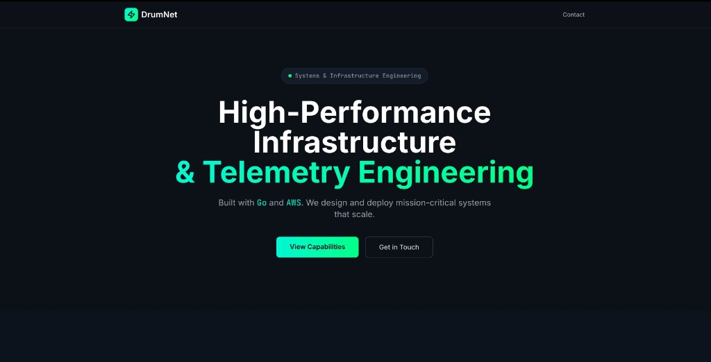

# DrumNet

High-performance infrastructure and telemetry engineering — built with **Go** and **AWS**.

DrumNet is a software consultancy that designs mission-critical systems for industrial telemetry and capital markets data.

---

## What we build

DrumNet helps operators and vendors move from prototype to production-grade infrastructure: live data ingestion, anomaly detection, low-latency delivery, and operator-facing dashboards that clients can trust.

**Stack:** Go · AWS · Kinesis · Lambda · Kafka · gRPC · TimescaleDB · Next.js · Terraform

---

## Projects

### VoltStream IoT — Industrial battery & solar telemetry

**The problem:** Fleet operators running batteries, inverters, and field hardware cannot afford blind spots. A single thermal event or state-of-charge collapse in the field means downtime, lost revenue, and reactive maintenance.

**The DrumNet answer:** VoltStream is an edge-to-cloud telemetry platform that ingests live metrics from 500+ assets, detects anomalies in real time, and surfaces fleet health in a single operator dashboard.

| Capability | Impact |
|---|---|
| High-frequency ingestion | ~250 packets/sec from simulated fleet edge |
| Predictive alerting | Thermal runaway and SoC degradation flagged before failure |
| Operator dashboard | Fleet status, live charts, and prioritized alerts |
| Cloud-native scale | Go ingestion → Kinesis → Lambda → Timestream |

**Built with:** Go, AWS Kinesis, Lambda, Timestream, Next.js, Terraform

**Client outcome:** Cut unplanned downtime, scale from pilot fleets to 500+ machines without re-architecture, and give operators one pane of glass.

→ [View project page](https://drumnet.vercel.app/)

---

### NGX Trading Platform — Market data for NGX ISVs

**The problem:** Independent software vendors serving the Nigerian Exchange need exchange-grade infrastructure — normalized feeds, entitlement-aware APIs, and sub-millisecond delivery that holds up at market open.

**The DrumNet answer:** A reference market data platform that ingests NGX feeds, normalizes symbols, enforces entitlements, and distributes low-latency data to brokers, fintech apps, and institutional clients.

| Capability | Impact |
|---|---|
| Tick ingestion & normalization | Clean symbol mapping for downstream ISV products |
| Entitlement-aware APIs | Vendor-ready distribution clients can productize immediately |
| Feed health monitoring | Visibility into latency, channel status, and delivery quality |
| Market-open scale | Burst throughput without latency spikes or dropped feeds |

**Built with:** Go, AWS, Kafka, gRPC, TimescaleDB, Entitlement APIs

**Client outcome:** Win market-open traffic, ship vendor-ready APIs, and prove reliability to regulated capital markets clients.

→ [View NGX Trading project page](https://drumnet.vercel.app/) 
---

## Contact

**Contact:** [Request for a Demo](https://drumnet.vercel.app/contact)

For VoltStream deployments, NGX market data platforms, or custom Go/AWS engineering — reach out via the site contact section or email directly.
